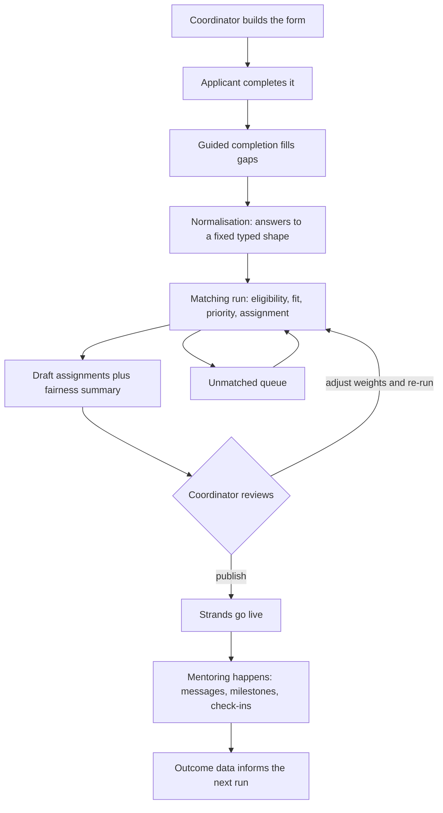
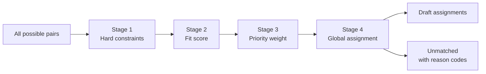

<div align="center">

# 🧬 Braid

### Equitable Mentorship Pairing Engine (EMPE)

**Team Quantum Solvers** · **UN SDG 5 — Gender Equality** · MMC × Grow with Google, 2026 cohort

*Mentorship shouldn't depend on who you already know.*

</div>

---

## 📋 Contents

- [The problem](#-the-problem)
- [What Braid does](#-what-braid-does)
- [The matching engine](#-the-matching-engine)
- [What equitable actually means here](#-what-equitable-actually-means-here)
- [Walkthrough video](#-walkthrough-video)
- [Running it](#️-running-it)
- [What's built](#-whats-built)
- [Architecture](#-architecture)
- [Testing and validation](#-testing-and-validation)
- [Security and privacy](#-security-and-privacy)
- [Grow with Google resources](#-grow-with-google-resources)
- [The team](#-the-team)
- [How we worked](#-how-we-worked)
- [Known limitations](#-known-limitations)
- [Future ideas](#-future-ideas)
- [References](#-references)
- [Licence](#-licence)

---

## 🧠 The problem

> **Early-career women in technical fields face systemic isolation due to a lack of structured access to professional network matching.**

That is our assigned problem statement, and we kept it unchanged throughout the project.

The evidence behind it is consistent across sources. Women make up only **35% of STEM graduates** globally, a figure largely unmoved for a decade, and just **26% of the data and AI workforce** (UNESCO, 2025). In Sub-Saharan Africa the gap widens: for every 100 men with spreadsheet skills, roughly **40–44 women** have the same proficiency. Fewer than 25% of tertiary students in Africa pursue STEM at all, and in 17 of 21 countries with sex-disaggregated data, women are **16% or less** of STEM graduates (UN OSAA, 2026).

Connectivity compounds it. The mobile internet gender gap in Sub-Saharan Africa stood at **26% in 2025**, with about **230 million women** in the region not using mobile internet (GSMA, 2026) — and professional networking increasingly happens online.

The same UN analysis names the cause we can actually build against: **limited exposure, insufficient role models, and weak mentorship networks.** It identifies mentorship as a key mechanism for connecting education to professional careers.

**So why isn't mentorship already solving this?** Because most mentorship programmes run on informal networks and manual pairing. Informal networking structurally favours people who already have access — precisely the wrong property for a system meant to widen it. And manual matching in a spreadsheet stops scaling somewhere around thirty participants, right when a programme starts to matter.

Braid attacks that operational gap. We are not claiming software fixes gender inequality in STEM. We are claiming that if a programme is going to allocate scarce mentor hours, it should do so **transparently, at scale, and with equity as an explicit input rather than an afterthought.**

---

## 💡 What Braid does

Braid is a working platform for organisations that run structured mentorship programmes. It covers the full lifecycle:



**Two things in that diagram are easy to miss and structurally important.**

*The loop from review back to matching.* A run is not a function that returns an answer. A coordinator can adjust the weighting and re-run before anything is published. Nothing reaches a participant until she chooses to publish.

*The loop from the unmatched queue.* People join in week three. A mentor drops out. Someone was never matched. That is not an edge case — it is the normal state of a live cohort, so the system re-runs continuously rather than once.

An organisation creates a programme and defines its own application form. Applicants answer it. A coordinator sets the matching criteria — which questions matter, how much, and which are non-negotiable. They start a **matching run**, review what the engine proposes, and publish it. Published matches become **strands**: one-to-one or group mentoring relationships with messages, milestones and progress tracking.

The pivot that defines the project: mentorship is a human relationship, so the algorithm **proposes and a coordinator disposes.** Nothing reaches a participant until a person has looked at it and pressed publish.

---

## ⚙️ The matching engine

This is the core of the project. It runs in five stages, deliberately kept separate — each answers a different question and each is separately inspectable.



### Stage 0 — Normalise

Application forms are defined per programme and unknown at compile time. This stage projects flagged answers into a fixed typed shape, so the form's arbitrary structure stops here instead of leaking into matching, reporting and export.

### Stage 1 — Eligibility (hard constraints)

Rules that must hold, not preferences. A pair failing any enabled constraint is **removed from consideration entirely**, not merely scored low — a heavily weighted preference can be overridden by a strong score elsewhere; a hard constraint cannot.

Four constraints, each switched on or off per programme:

| Constraint | What it enforces |
|---|---|
| `role_compatible` | Mentor and mentee roles fit the pairing |
| `shared_skill` | At least one skill or domain in common |
| `same_timezone_band` | Within 3 hours — beyond that a fortnightly call stops being arrangeable |
| `different_team` | No conflict of interest, e.g. the same reporting line |

A profile below **25% completeness** is also held back: pairing on almost no information produces a match neither side can see the reason for.

There are deliberately few constraints, and the interface states the cost of each, because every one switched on shrinks the pool and a shrunken pool is what produces unmatched people.

### Stage 2 — Fit

How good a pairing would be, from 0 to 1. Option answers compare by **Jaccard overlap** (shared over combined); numeric and scale answers by closeness. Each weighted question contributes proportionally.

One detail worth calling out: the total is divided by **the weight actually used, not the weight configured**, so a pair is never penalised for questions neither person was asked.

### Stage 3 — Priority

How much difference the structured route makes *to this person*. Deliberately kept apart from fit — mixing quality-of-pairing and who-most-needs-one into a single number is what makes a system impossible to explain afterwards.

This is not merit, and not need in a charitable sense. From the code:

> *A woman with two existing mentors and a strong network loses less by waiting a round than one who has neither, so the same mentor hour produces more for the second.*

Scores collapse into **high / medium / low bands**, because the question a coordinator must be able to answer — "did high-priority mentees do as well as everyone else?" — needs groups to compare.

### Stage 4 — Global assignment

The stage that makes the rest worth doing, and the one most worth explaining to a non-technical reader. Consider three ways to assign mentors:

| Approach | Who gets the best mentors | Problem |
|---|---|---|
| First come, first served | Whoever applied earliest | Rewards being online at the right moment |
| Greedy by score | Whoever scores highest, one pair at a time | Rewards presenting well on paper |
| **Global assignment** | Whatever combination is best for the cohort | **This is ours** |

Greedy matching — walk the list, give each mentee her best available mentor — looks reasonable and isn't. Early decisions consume options that later mentees needed more. If the second mentee is the only person who could have worked with a particular mentor, and the first took him because he was marginally her best option too, every individual choice was locally sensible and the cohort came out worse.

So Braid solves **the whole cohort at once**: a cost matrix over every eligible pair, minimised globally via `scipy.optimize.linear_sum_assignment` (the Hungarian algorithm), subject to mentor capacity, a coverage floor, and bounded priority weighting.

Capacity is handled by column expansion — a mentor with two places appears as two columns, so the solver physically cannot over-assign her however good a fit she looks to everybody.

The priority multiplier is **bounded on purpose**. Priority resolves ties and tilts close calls; it does not let a poor pairing beat a good one, because a mentee matched to somebody unsuitable has not been helped by being matched first.

This is a well-understood class of problem. **The engineering is not novel; the objective function is where the contribution sits** — and it is where Braid differs from platforms that optimise total match quality alone. Maximising a plain sum always permits sacrificing the tail, and the tail here is exactly the people the project is for.

### Then: the fairness summary, before any names

When a run finishes, the review screen shows the **distribution before the pair list**:

| What | Why it's there |
|---|---|
| Coverage rate | How many mentees got matched at all |
| Mentor load vs capacity | Whether the work landed evenly |
| Mean and median quality **per priority band** | Whether high-priority mentees did as well as everyone else |
| Score distribution | The shape of the cohort, not just its average |
| Unmatched queue with reason codes | Each reason has a different remedy, so it stores a code, not a sentence |

That ordering is the argument. A list of pairs actively hides whether the run was fair; a single average can't answer the question either.

---

## ⚖️ What equitable actually means here

"Equitable" is easy to put in a project title. Concretely, in this codebase, it means five things:

1. **Equity is an input, not a report.** Priority influences the objective function the solver minimises — it is not a chart produced after the fact.
2. **Fit and priority never merge.** Two separate numbers, so any outcome can be explained.
3. **Distribution is shown before names.** The coordinator sees fairness metrics above the pair list, by design.
4. **A human publishes.** Draft matches are reversible; nothing reaches a participant automatically.
5. **Reporting withholds small groups.** Demographic breakdowns suppress any group of **three or fewer** rather than rounding, and state how many were withheld — and they count only participants who gave explicit reporting consent (8 of 22 in the seeded cohort, not all 22).

Point 5 matters more than it looks. A fairness dashboard that quietly re-identifies the two women in a cohort has not protected anybody.

---

## 🎥 Walkthrough video

> **▶️ [We built a mentorship pairing engine that shows its working](https://youtu.be/Za1TMwE46hk)**
>
> A walkthrough of the platform: a live matching run, the fairness summary, and
> the reasoning behind an individual pair.

If you would rather drive it yourself, this is the order that shows the most:

1. Programme landing page and the application form
2. Coordinator roster and applications review
3. **Start a matching run** — watch it go queued → drafted
4. The fairness summary: coverage, mentor load, quality by band
5. **Publish** — matches become strands
6. The participant side: strands, messages, milestones
7. Reports — coverage steps up, quality-by-band fills in
8. The invitation flow arriving cold, with no session

---

## 🛠️ Running it

Three parts: Postgres, the FastAPI backend, the Next.js frontend.

```bash
# 1. Database (from the repo root)
DB_PORT=5433 docker compose up -d db

# 2. Backend
cd api
uv sync                                    # first time only
cp .env.example .env                       # first time only
uv run alembic upgrade head                # create the tables
uv run python -m app.seed                  # load the sample cohort
DEMO_MODE=true uv run uvicorn app.main:app --port 8000

# 3. Frontend (second terminal, from the repo root)
cd web
npm install                                # first time only
npm run dev
```

Open **http://localhost:3000/signin** and choose **Explore as a coordinator** or **Explore as a participant**.

`DB_PORT=5433` is only needed if you already run Postgres on 5432; it must match `DATABASE_URL` in `api/.env`.

**Frontend only, no database required.** Set `NEXT_PUBLIC_API_MOCKING=enabled` in `web/.env.local` and run `npm run dev`. A full mock backend serves every screen.

**Reset the demo data** at any time — safe to repeat:

```bash
cd api && uv run python -m app.seed
```

Full run guide: [`RUNNING.md`](RUNNING.md). Project documents: [`docs/project/`](docs/project/).

---

## ✅ What's built

All **60 operations** in the OpenAPI contract are implemented against the real backend. No screen depends on the mock.

| Area | Status |
|---|---|
| Organisations, programmes, multi-programme support | ✅ Working |
| Applications with programme-specific dynamic forms | ✅ Working |
| Save and resume a part-filled application | ✅ Working |
| Magic-link and demo authentication, sessions | ✅ Working |
| Roster, directory, participant profiles | ✅ Working |
| Matching criteria, weights, hard constraints, test run | ✅ Working |
| **Matching runs — start, poll, review, publish** | ✅ Working |
| Fairness summary and unmatched queue | ✅ Working |
| Manual pairing from the unmatched queue | ✅ Working |
| Strands (1:1 and group), messaging | ✅ Working |
| Milestones, templates, broadcasts, nudges | ✅ Working |
| Reports — coverage, funnel, fairness, demographics | ✅ Working |
| Audit log | ✅ Working |
| Account settings, invitations, waitlist | ✅ Working |
| Session tracking with dates | ⚠️ Count only, no dates |
| Structured check-ins | ⚠️ Sent as messages, not recorded answers |

The two ⚠️ rows are reported honestly on the Reports page itself: those sections stay empty and **say why**, because neither can be placed on a time axis truthfully yet. We considered inventing plausible-looking charts and decided a blank section with an explanation is worth more than a chart that implies data we don't have.

**Scale of the build:** 49 API paths · 60 operations · 33 frontend pages · 54 Python modules.

---

## 🏗 Architecture

A monorepo with one contract read by both sides.

```
openapi.yaml           the contract — one copy, both sides read it
docker-compose.yml     Postgres
api/                   FastAPI backend
  app/matching/        the engine: normalise, eligibility, scoring, assign
  app/models/          SQLAlchemy models
  app/routers/         HTTP layer
  app/services/        business logic, reporting
  alembic/             migrations
web/                   Next.js frontend (App Router, TypeScript strict)
  app/                 four route groups, four guards
  lib/api/             typed clients generated from openapi.yaml
  styles/tokens.css    the design system's single source of colour
docs/                  architecture, design direction, brand reference
  project/             concept note, charter, plan, WBS/RACI/Gantt/risk
design/                design files
```

**Stack.** FastAPI · SQLAlchemy · Alembic · PostgreSQL · NumPy/SciPy · Next.js 16 · React · TypeScript (strict) · Tailwind v4 · React Hook Form · Zod · TanStack Query · MSW.

Three decisions worth knowing:

- **Types are generated, never hand-written.** `openapi.yaml` produces `web/lib/api/types.ts`. Contract and client cannot drift.
- **Role lives on participation, not on account.** The same person is a mentee in one programme and a mentor in another. Getting this wrong early would have been expensive to unwind.
- **Design tokens are enforced by the build.** Tailwind's stock palette is reset to `initial`, so `text-gray-500` is not a class. A colour that isn't a token cannot be used by accident.

### Handling a form the system has never seen

Every organisation asks different questions, so the application form is built by the coordinator and is unknown when the code is written. This is the hardest engineering constraint in the project.

The approach is **dynamic at the edge, fixed at the core**:

1. The form definition is stored as a **versioned JSON document** with stable identifiers for every question. Answers are keyed by those identifiers, never by the question's text — so renaming a question does not orphan two hundred existing answers.
2. Publishing a form **creates a new version**. Applications already submitted keep the version they answered, permanently.
3. **Normalisation** then projects only the flagged fields into a fixed, typed table. Everything downstream reads that table, so the form's arbitrary shape stops there instead of leaking into matching, reporting and export.

Each question carries three flags set by the coordinator, and these are what connect the form to the engine:

| Flag | Effect |
|---|---|
| `matching` | Feeds the compatibility score |
| `equity` | Feeds the priority score |
| `admin` | Collected for the coordinator, never scored |

Each `matching` field also carries a **direction** — `similar` (both work in data engineering) or `complementary` (the mentee wants what the mentor already has).

---

## 🧪 Testing and validation

| Check | Result |
|---|---|
| `npx tsc --noEmit` (strict) | ✅ Clean |
| `npm run lint` (ESLint) | ✅ Clean |
| `uv run ruff check .` | ✅ Clean |
| End-to-end flow against the real backend | ✅ Verified |

**The matching engine was validated on a seeded 22-participant cohort.** A full run produced 9 matches at 64.3% coverage with the fairness summary populated across all three priority bands, then published successfully to the participant side.

One finding worth recording, because it shows the capacity logic works: the fairness panel displayed a mentor at **load 4 against capacity 3**. Investigation confirmed the run assigned her **zero** new mentees — the excess was pre-existing strands from seed data, and `capacity - load` had correctly clamped her remaining places to zero. The engine refused to over-assign. The display shows total commitment against nominal capacity, which is the honest number for a coordinator to see.

Coverage below 100% is expected and correct: it reflects genuine mentor scarcity in the sample cohort, and those mentees land in the unmatched queue with a reason code rather than being force-matched to someone unsuitable.

---

## 🔒 Security and privacy

- **Session-based authentication** with HttpOnly cookies; magic-link sign-in with tokenised verification.
- **Route guards live in layouts**, resolved once per request; pages assume the guard passed. Four route groups exist precisely because they need four different guards.
- **Role-based access.** Coordinator endpoints verify participation and coordinator status server-side — never from a client-supplied claim.
- **Data minimisation.** Demographic reporting is opt-in, and small groups are suppressed rather than rounded.
- **Audit log** records administrative actions.
- **No real personal data.** The entire demo runs on synthetic seed data.

---

## 🌱 Grow with Google resources

This project is a direct application of the Grow with Google curriculum. The clearest line runs from the IT Automation with Python track into the backend and matching engine.

### Google IT Automation with Python — Professional Certificate

Completed 11 July 2026, all seven courses · [verify](https://coursera.org/verify/professional-cert/HJGCZTT6OBZU)

| Course | Where it shows up in Braid |
|---|---|
| Crash Course on Python | The whole `api/` backend and the matching engine in `api/app/matching/` |
| Using Python to Interact with the Operating System | Environment and configuration handling, the seed and migration tooling |
| Introduction to Git and GitHub | Version control across the monorepo, branching, and this submission's PR workflow |
| Troubleshooting and Debugging Techniques | Tracing the mentor-capacity finding in [testing](#-testing-and-validation) to its actual cause rather than its symptom |
| Configuration Management and the Cloud | `docker-compose.yml`, the containerised build, environment-based configuration |
| Automating Real-World Tasks with Python | `python -m app.seed` — repeatable cohort seeding; Alembic migrations |
| Accelerate Your Job Search with AI | Working effectively alongside AI tooling during development |

Two courses also hold standalone certificates: [Introduction to Git and GitHub](https://coursera.org/verify/LWB9BMD05EKX) and [Using Python to Interact with the Operating System](https://coursera.org/verify/C36ESRSXKIJZ).

**Skills carried into this build:** Python · Git and GitHub · automation scripting · configuration management · debugging and troubleshooting · working with APIs · environment and dependency management · testing and validation.

### Google Project Management — Professional Certificate

Benardette Xetsa Setutsinam Afi Gati · completed 10 July 2026, all seven courses · [verify](https://coursera.org/verify/professional-cert/1QRM449PD1LM)

Foundations of Project Management · Project Initiation · Project Planning · Project Execution · Agile Project Management · Capstone · Accelerate Your Job Search with AI.

Applied directly to this project's governance: the work breakdown structure, RACI matrix, Gantt chart and 12-item risk register in [`docs/project/project-management-tools.md`](docs/project/project-management-tools.md), the [project charter](docs/project/project-charter.md), and the agile five-phase delivery plan the team actually ran to.

### Across the team

| Member | Grow with Google track | Contribution |
|---|---|---|
| Benardette Xetsa Setutsinam Afi Gati | Project Management ✅ | Planning, requirements, documentation, risk and testing oversight |
| Eulleria Gitau | Data Analytics | Compatibility factors, scoring model, evaluation metrics |
| Jeff Mbita | Cybersecurity | Access control, privacy, risk assessment, security testing |
| Omogbolaga Daramola | IT Automation with Python ✅ | Full-stack build — backend, frontend, matching engine, integration |

Every member completed their respective Grow with Google track; certificate completion was the entry criterion for the cohort. Each track maps onto a different layer of the platform, which is what made a four-week build of this scope possible.

---

## 👥 The team

**Quantum Solvers** — a cross-functional team, which is the point: each track owns a different layer of the platform.

| Member | Specialisation | Contribution |
|---|---|---|
| **Benardette Xetsa Setutsinam Afi Gati** | Project Management | Planning, coordination, requirements, documentation, testing oversight |
| **Eulleria Gitau** | Data Analytics | Matching criteria, compatibility factors, scoring logic, evaluation metrics |
| **Jeff Mbita** | Cybersecurity | Authentication, privacy, access control, risk assessment, security testing |
| **Omogbolaga Daramola** | IT Automation with Python | **Full-stack engineer** — backend and frontend, APIs, matching engine, integration, automation |

Governance was tracked with a full RACI matrix, WBS, Gantt chart and risk register — all in [`docs/project/`](docs/project/).

---

## 📆 How we worked

Agile MVP delivery across four weeks, **15 July – 14 August 2026**.

| Phase | Dates | Focus |
|---|---|---|
| 1 · Initiation & discovery | 15–21 Jul | Problem validation, users, MVP scope, roles |
| 2 · Product & system design | 22–28 Jul | Data model, compatibility factors, architecture, matching framework |
| 3 · Platform development | 29 Jul – 4 Aug | Profiles, data layer, scoring, matching engine, interface |
| 4 · Testing & optimisation | 5–10 Aug | Functional, matching, fairness, security and usability testing |
| 5 · Demonstration & delivery | 11–14 Aug | QA, documentation, demo, submission |

**A change we made deliberately.** The project began as compatibility-based mentor *discovery* — a user browses recommended mentors. During design we concluded that discovery reproduces the original inequity: the confident and well-networked browse effectively, and the isolated do not. So the engine moved to **cohort-wide allocation with coordinator review**. The person who most needs a mentor no longer has to know how to go looking for one.

A second change followed from the first. Early planning assumed a low-code platform; once matching became a global optimisation over a cost matrix with capacity constraints, we built it properly in Python with SciPy, and the frontend in Next.js against a typed contract.

**Risks we tracked** (12 in the register) and what actually happened: mentor scarcity leaving mentees unmatched (**materialised** — handled with the unmatched queue and reason codes), matching quality (**mitigated** — validated on seeded scenarios), and the four-week timeline (**mitigated** — strict MVP boundaries, sessions and check-ins consciously left partial rather than faked).

---

## ⚠️ Known limitations

Stated plainly, because a prototype that hides its edges is harder to build on.

- **No skill taxonomy.** "Backend engineering", "back-end dev" and "server-side" don't yet collapse to one canonical skill. Option answers compare exactly because they're stored by id; free text does not. This matters more than it sounds: the `shared_skill` hard constraint compares raw strings, so two people in the same field can fail to match because one typed a hyphen. The design is an organisation-level taxonomy of canonical skills and synonyms, with anything that doesn't map cleanly going to a coordinator review queue rather than being silently discarded or silently guessed. It is data work with no clever shortcut, and it is the difference between matches that are good and matches that merely run.
- **Sessions have no dates**, so they can't be placed on a time axis.
- **Check-ins are messages**, not questions with recorded answers, so sentiment can't be derived.
- **No file upload endpoint**, so file fields in application forms are collected but not stored.
- **No email provider configured.** Magic links print to the API log; demo sign-in exists because seeded accounts use `example.org` addresses.
- **Not load-tested.** Validated on a 22-participant cohort. The Hungarian algorithm is O(n³), which is fine at cohort scale and would need attention in the thousands.
- **Efficiency measured, not proven.** The 50% administrative-reduction target in our charter is an objective, not a measured result — it needs a real programme to verify.

---

## 🔮 Future ideas

Breadcrumbs for the next cohort. Ordered by what we'd pick up first.

1. **A skill taxonomy with a review queue.** The highest-value single improvement. Free text that doesn't map cleanly should reach a coordinator rather than being silently discarded or silently guessed.
2. **Sessions with real dates**, unlocking engagement-over-time reporting.
3. **Structured check-ins** as forms with recorded answers, unlocking honest sentiment and response-rate reporting.
4. **Swap, lock, reject and re-run** on the review screen — let a coordinator pin a pair they like and re-run the rest.
5. **Outcome tracking.** Did the mentorship help? Six-month follow-up would let the weights be tuned against real outcomes instead of intuition.
6. **Explain this match.** The fit breakdown is already computed per field; surfacing it to participants would build trust in the pairing.
7. **Mentor recruitment signals.** The unmatched queue knows exactly which skills lacked capacity — that's a recruitment brief waiting to be written.
8. **Accessibility audit** against WCAG 2.2, and an offline-tolerant mode given the connectivity gap the research identifies.
9. **Email delivery**, so magic links and notifications work outside a demo.

---

## 📚 References

- GSMA. (2026). *The mobile gender gap report 2026.*
- UNESCO. (2025, August 4). *Closing the digital divide for women and girls in Africa through education.*
- United Nations Office of the Special Adviser on Africa. (2026, February 23). *The power of mentorship: Building a generation of STEM professionals through guided pathways.*
- World Bank. (n.d.). *Africa Gender Innovation Lab (GIL): Reports and knowledge products.*

---

## 📄 Licence

MIT — see [LICENSE](LICENSE). Built for MMC × Grow with Google. Fork it, extend it, make it better.

<div align="center">

**Quantum Solvers** · 2026 cohort

*Built so the person who most needs a mentor doesn't have to know how to go looking for one.*

</div>
