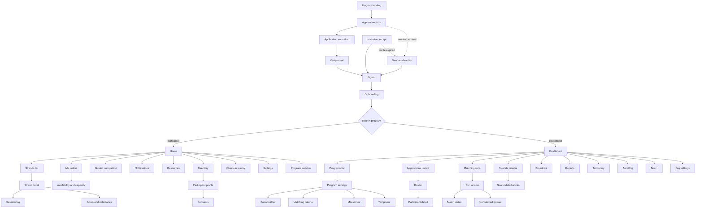

# Braid

A mentoring platform for organisations that run structured mentoring programs. An organisation creates programs. Each program has its own application form, its own matching rules, its own roster, and its own report. Within a program, a mentoring relationship is a **strand**. A strand can be one to one or a group.

Naming: product **Braid**, relationship unit **strand**. Alternates considered: Relay (unit: relay), Bridge (unit: bridge).

---

## 1. Core model

Four entities carry the whole system. Get these right and the pages fall out of them.

|Entity|Scope|Notes|
|---|---|---|
|`Organisation`|tenant|Owns programs, coordinators, taxonomy, branding, audit log|
|`Program`|cohort|Owns form schema, matching recipe, roster, strands, reports|
|`Account`|global|One person, one login, one email. Exists above organisations|
|`Participation`|account x program|Role, application answers, profile, availability, status|
|`Strand`|program|The relationship. 1:1 or group. Has an origin mode and a lifecycle state|

**The rule that shapes everything:** role lives on `Participation`, never on `Account`. The same person is a mentee in the UNILAG program and a mentor in the She Code Africa program, simultaneously, with different answers to different forms. Every participant-facing query is scoped by `program_id`. Every admin query is scoped by `organisation_id` and usually also `program_id`.

**Strand origin modes:** `manual`, `self`, `batch`. Stored on the strand, because reports need to answer "did the algorithm do better than the coordinator's hand-picks".

**Strand states:** `draft`, `active`, `paused`, `ended`, `discarded`. Only batch runs produce drafts.

---

## 2. Sitemap

---

## 3. Public pages

No session required. These are the only pages a search engine or a cold link ever hits.

### 3.1 Program landing `/p/:orgSlug/:programSlug`

The recruitment page. A coordinator sends this link out on WhatsApp and LinkedIn.

- Shows: program name, host organisation, one-paragraph description, cohort dates, application deadline, expected time commitment, who is eligible, which roles are currently open, count of mentors and mentees signed up so far.
- Actions: apply as mentee, apply as mentor, sign in if already a member.
- States: not yet open, open, closed, program full. A closed program still renders with a waitlist option rather than a 404.

### 3.2 Application form `/p/:orgSlug/:programSlug/apply?role=`

Renders whatever the coordinator built in the form builder. This page has no hardcoded knowledge of any question.

- Shows: multi-step wizard, one section per step, progress indicator, conditional questions that appear based on earlier answers.
- Field types to support: short text, long text, single select, multi select, scale, number, date, file upload, consent checkbox.
- Actions: save and continue later (emails a resume link), back, next, submit.
- Behaviour: autosave on blur. Client-side validation on required fields. Role is fixed from the query param and shown, not editable mid-form.
- Not built yet: the emailed resume link. Autosave writes to `PUT /orgs/{org}/programs/{program}/application-draft` and the draft id is held in the browser that started the form, so a draft cannot currently be picked up on another device. The screen says so plainly rather than implying a persistence it does not have. Building the link needs an endpoint that mints and mails a scoped token, the same shape as the magic link.

### 3.3 Application submitted `/p/:orgSlug/:programSlug/applied`

Prevents the "did it go through" email.

- Shows: confirmation, what happens next, when matching runs, when they will hear back.
- Actions: resend verification email, edit application while the window is open.

### 3.4 Sign in `/signin`

- Shows: email field, magic link as primary path, password as secondary.
- Actions: send magic link, sign in with password, forgot password.

### 3.5 Verify email `/verify/:token`

Token landing. Consumes the token, marks the account verified, redirects to home or to the program the invite came from. Handles expired and already-used tokens with a resend action rather than an error page.

### 3.6 Reset password `/reset` and `/reset/:token`

Two pages: request, then set new.

### 3.7 Invitation accept `/invite/:token`

For participants the coordinator adds by CSV or direct invite rather than open application.

- Shows: who invited them, which program, which role.
- Actions: accept and create account, accept into existing account, decline.

---

## 4. Participant pages

All scoped to one program at a time. The shell carries a program switcher, because the same account may be in several.

### 4.0 Onboarding `/o/:org/p/:program/welcome`

Runs once, on first login into a program. Not the application. The application was for the coordinator; this is for the participant.

- Shows: three or four steps. What this program is and how long it runs, what your role is expected to do, what a good first session looks like, the code of conduct.
- Actions: next, accept the code of conduct, finish.
- Behaviour: cannot be skipped on first entry, since acceptance is recorded and shown in the audit log. Re-openable later from Resources. Runs again per program, because the same account joining a second program has a different role and different expectations.

### 4.1 Home `/o/:org/p/:program`

The first screen after sign-in. Answers one question: what should I do right now.

- Shows: next action card (complete your profile, accept a request, reply to a message, log your session, fill your check-in), active strands with last activity and unread count, profile completeness bar, coordinator announcement banner, upcoming milestone.
- Actions: everything is a link into the page that resolves it. No work happens here.
- Empty state before matching: "You are in. Matching opens on 14 September." This state exists for weeks and matters more than the populated one.

### 4.2 My profile `/o/:org/p/:program/me`

What other participants see. Separate from the edit form so a participant can check their own presentation.

- Shows: name, photo, headline, role in this program, skills, goals, bio, experience, languages, availability summary.
- Actions: edit, complete missing sections, preview as another participant sees it.

### 4.3 Profile edit `/o/:org/p/:program/me/edit`

Same fields as the application form, post-submission. Grouped by section with per-section save.

- Actions: save section, upload photo, add or remove skills, change goals.
- Note: a field flagged `matching: true` in the form builder shows a warning that changing it after publication will not re-run matching.

### 4.4 Guided completion `/o/:org/p/:program/me/complete`

The equity mechanism at the input layer. A thin answer does not get rewritten. It gets a follow-up question.

- Shows: one question at a time, drawn from whichever profile fields are empty or below a substance threshold. Each question is specific: "You said you want to grow in backend. What have you built recently, even something small?"
- Actions: answer, skip, finish later.
- Behaviour: the participant's words are stored verbatim. Structured tags are extracted from the answer and shown back for confirmation before they are saved. Nothing is written to the profile without an explicit accept. Every field records provenance: `self` or `guided`.
- Why it exists: writing fluency correlates with schooling and language background, and if soft signals are scored from free text then fluency silently becomes a ranking feature. Elicitation equalises field coverage without flattening voice.

### 4.5 Availability and capacity `/o/:org/p/:program/me/availability`

Mentors only.

- Shows: how many mentees they can take, current load, preferred meeting cadence, time zone, general weekly windows, availability toggle.
- Actions: set capacity, pause availability, resume, set unavailable dates.
- Behaviour: setting capacity below current load does not auto-end strands. It flags the coordinator.

### 4.6 Strands list `/o/:org/p/:program/strands`

- Shows: every strand the participant is in, 1:1 and group, with partner name and photo, last message preview, unread badge, next scheduled session, health hint if quiet.
- Actions: open, filter by active or ended.

### 4.7 Strand detail `/o/:org/p/:program/strands/:id`

The core screen. Most of the product's actual value is here and it is deeper than it looks.

- Layout: three regions. Left or top is the partner card. Centre is the conversation. Right or bottom is the working state.
- Partner card shows: photo, headline, skills, goals, time zone, and why you were matched.
- Conversation shows: message thread, file attachments, coordinator-inserted prompts at milestone points.
- Working state shows: shared goals, milestone checklist for the program, session history, suggested agenda for the next session, shared resources.
- Actions: send message, attach file, propose a session time, log that a session happened with a duration and a note, add a goal, mark a milestone complete, request a pause, report a concern to the coordinator, end the strand with a reason.
- Behaviour: logging a session matters more than scheduling one. It is the primary engagement signal feeding both the health monitor and the report.

### 4.8 Group strand detail

Same route, different rendering when the strand has more than two members.

- Additional: member list with roles, per-member read state, no private one-to-one thread inside the group.
- Actions: same, minus the pair-specific ones. Ending applies to the whole group and only the coordinator can do it.

### 4.9 Directory `/o/:org/p/:program/directory`

Only exists if the coordinator enabled self-matching.

- Shows: participant cards filtered to the opposite role, with search and filters on skills, goals, and availability. Mentors at capacity are shown as unavailable rather than hidden, so the scarcity is visible.
- Actions: open a profile, filter, search.

### 4.10 Participant profile `/o/:org/p/:program/directory/:participationId`

- Shows: the public profile, plus whether they have capacity and how many pending requests they hold.
- Actions: send a match request with a short message, subject to the program's pending-request cap.

### 4.11 Requests `/o/:org/p/:program/requests`

- Shows: two lists, sent and received, each with status pending, accepted, declined, expired.
- Actions: accept (creates an active strand immediately), decline with optional reason, withdraw a sent request.

### 4.12 Sessions `/o/:org/p/:program/sessions`

- Shows: upcoming proposed and confirmed sessions across all strands, past sessions with logged notes.
- Actions: confirm, propose an alternative, cancel, log a past session retroactively, export to calendar.

### 4.13 Check-in `/o/:org/p/:program/checkin/:id`

System-triggered survey at set intervals.

- Shows: three to five questions. Is this working, how often are you meeting, one thing going well, one thing not.
- Actions: submit, snooze once.
- Behaviour: feeds strand health, program reporting, and the matching priors for the next run.

### 4.14 Notifications `/o/:org/p/:program/notifications`

- Shows: chronological list with read state, grouped by strand where relevant.
- Actions: mark read, mark all read, jump to source.

### 4.15 Resources `/o/:org/p/:program/resources`

Static content the coordinator uploads.

- Shows: program handbook, expectations for mentors and mentees, conversation starters, code of conduct.
- Actions: open, download.

### 4.16 Settings `/settings`

Account level, not program level.

- Shows: name, email, password, notification preferences per channel, connected programs.
- Actions: change password, set digest frequency, mute a program, leave a program, delete account.

### 4.17 My programs `/programs`

The switcher, as a full page as well as a header dropdown.

- Shows: every program the account participates in, with organisation, role in that program, status, unread count.
- Actions: switch, view an ended program in read-only mode.

---

## 5. Coordinator pages

Sidebar shell. Program selector at the top of the sidebar, since most actions are program-scoped.

### 5.1 Dashboard `/admin/o/:org`

Program health in one screen. The coordinator opens this daily during a live cohort.

- Shows: signups against recruitment goal, mentee to mentor ratio, matched versus unmatched counts, active versus quiet strands, sessions logged this week, upcoming milestone, and an attention list of things that need a human.
- Attention list items: applications awaiting review, requests pending over seven days, strands with no message in fourteen days, mentors over capacity, participants with incomplete profiles blocking matching.
- Actions: every item links to the page that resolves it.

### 5.2 Programs list `/admin/o/:org/programs`

- Shows: all programs in the organisation with state (draft, open, matching, running, closed), participant count, coverage rate, dates.
- Actions: create program, duplicate an existing program including its form and criteria, archive.

### 5.3 Program settings `/admin/o/:org/programs/:id/settings`

- Shows: name, slug, description, cohort dates, application window, mentoring format (1:1, group, both), recruitment goal, self-matching toggle, pending-request cap, strand size limits for groups.
- Also: editable welcome message with name merge codes, editable match notification email, editable rejection and waitlist messages.
- Actions: save, launch program, close applications, close program.

### 5.4 Form builder `/admin/o/:org/programs/:id/form`

The page that makes this a product rather than a script.

- Shows: two panes. Left is the question list with drag-to-reorder and section grouping. Right is a live preview of the applicant's view.
- Per question: label, help text, field type, required flag, options for select types, conditional display rule, and three flags that decide downstream behaviour.
    - `matching` — feeds the similarity score
    - `equity` — feeds the priority score
    - `admin` — collected but never scored, visible to the coordinator only
- Actions: add question, duplicate, reorder, delete, set conditions, preview as mentee, preview as mentor, publish schema.
- Behaviour: separate schemas per role, since mentors and mentees answer different questions. Publishing is versioned. Editing a live form creates a new version and existing applications keep their original version.

### 5.5 Matching criteria `/admin/o/:org/programs/:id/criteria`

The recipe. Reads directly from the published form schema, so the two pages are coupled.

- Shows: three groups.
    - Hard constraints: same time zone band, must share at least one skill, must not be in the same team, role compatibility.
    - Weighted preferences: each `matching` field with a slider and a direction (similar or complementary).
    - Fairness rules: mentor capacity cap, coverage floor, priority weight for each `equity` field.
- Actions: adjust weights, add or remove constraints, save as a named recipe, test run on the current roster without publishing.
- Behaviour: the test run outputs the fairness summary only, not the pairs, so weight tuning is not driven by looking at individual matches.

### 5.6 Milestones `/admin/o/:org/programs/:id/milestones`

- Shows: the program arc as a timeline. What should happen by week two, week six, week twelve.
- Actions: add milestone, set the prompt shown inside strands at that point, set reminder timing, reorder.

### 5.7 Templates `/admin/o/:org/programs/:id/templates`

- Shows: message templates for welcome, match notification, nudge, mid-point check-in, closing.
- Actions: edit, insert merge codes, preview, reset to default.

### 5.8 Applications review `/admin/o/:org/programs/:id/applications`

- Shows: submitted applications in a table with role, submitted date, completeness, flags, and any answer the coordinator pinned as a review column.
- Actions: open, approve into roster, waitlist, reject with a template, bulk approve, export CSV.

### 5.9 Roster `/admin/o/:org/programs/:id/roster`

- Shows: all approved participants, filterable by role, status, capacity, matched or unmatched, profile completeness.
- Actions: invite by email, import CSV with column mapping, change role, remove from program, message selected, export.

### 5.10 Participant detail `/admin/o/:org/participants/:participationId`

- Shows: full profile, raw application answers with the form version they answered, strand history, engagement summary, check-in responses, coordinator notes, provenance flags on each field showing self versus guided.
- Actions: edit on their behalf, add a note, adjust capacity, mark unavailable, remove, view their activity in other programs in this organisation only.

### 5.11 Matching runs `/admin/o/:org/programs/:id/runs`

- Shows: every run with timestamp, which recipe version, how many drafted, how many published, coverage achieved, who published it.
- Actions: start a new run, open a past run, discard a draft run.

### 5.12 Run review `/admin/o/:org/runs/:runId`

Where the coordinator does the real work. A run is a stored object with a state, not a function call.

- Shows: the fairness summary for this run first, above the pair list. Coverage rate, mentor load distribution, priority-band breakdown showing whether high-priority mentees got comparable match quality to low-priority ones, and the score distribution.
- Then: the draft pair list with mentee, mentor, score, and priority band.
- Then: the unmatched count with a link to the queue.
- Actions: open a pair, swap two mentors between pairs, reject a pair back to unmatched, lock a pair so a re-run preserves it, re-run with adjusted weights, publish all, publish selected, discard run.
- Behaviour: publishing is the only irreversible action on this page and it triggers notifications. Confirm with the counts spelled out.

### 5.13 Match detail `/admin/o/:org/runs/:runId/pairs/:pairId`

- Shows: both profiles side by side, the score broken into its components, which hard constraints bound, and honestly stated counterfactual information: what this mentee's next-best option was and why it was not taken.
- Actions: approve, reject, swap, lock, add a note.
- Note on honesty: in a global assignment the true reason a mentee got a particular mentor is often about a third person. Per-pair feature attribution is a partial explanation, not the explanation. Label it as such rather than presenting it as a full rationale.

### 5.14 Unmatched queue `/admin/o/:org/programs/:id/unmatched`

- Shows: everyone with no strand, each with a reason code. No mentor capacity remaining, no viable skill overlap, joined after the run, profile incomplete, all candidates declined.
- Actions: match manually, add to the next run, move to a group strand, waitlist, message.

### 5.15 Strands monitor `/admin/o/:org/programs/:id/strands`

- Shows: every strand with members, origin mode, days since last activity, sessions logged, milestone progress, and a health signal derived from those.
- Actions: filter to quiet strands, send a nudge from a template, open the strand in admin view, pause, end and rematch.

### 5.16 Strand detail admin `/admin/o/:org/strands/:id`

- Shows: metadata, session log, milestone state, check-in responses from both sides, and whether message content is visible depends on the organisation's privacy setting, which is set once at org level and shown to participants at signup.
- Actions: nudge, end, rematch, note.

### 5.17 Broadcast `/admin/o/:org/programs/:id/comms`

- Shows: composer with segment selector (all, mentors, mentees, unmatched, quiet strands, incomplete profiles), template picker, and send history.
- Actions: compose, preview with merge codes resolved, send now, schedule, view delivery status.

### 5.18 Reports `/admin/o/:org/programs/:id/reports`

The page the coordinator sends to a funder. This is her deliverable, not a vanity dashboard.

- Shows: coverage rate over time, mentor load distribution, match quality distribution split by priority band, session frequency, check-in sentiment, milestone completion, drop-off points, and demographic breakdowns limited to fields the participants consented to share.
- Actions: set date range, export CSV, export PDF, save a report view.

### 5.19 Taxonomy `/admin/o/:org/taxonomy`

Organisation level, shared across programs. Unglamorous and it decides whether matches are any good.

- Shows: canonical skills and roles, their synonyms, and a review queue of free-text answers that did not map cleanly.
- Actions: map a raw term to a canonical one, create a canonical term, merge duplicates, add a synonym, bulk approve suggested mappings.

### 5.20 Audit log `/admin/o/:org/audit`

- Shows: who changed what and when. Criteria edits, manual overrides on published matches, participant edits made on someone's behalf, form schema versions, run publications, data exports.
- Actions: filter by actor, entity, date. Export.
- Why it exists: the fairness claim is only inspectable if the deviations from the algorithm are recorded.

### 5.21 Team `/admin/o/:org/team`

- Shows: coordinators and admins with per-program access.
- Actions: invite, set role, scope to specific programs, remove.

### 5.22 Organisation settings `/admin/o/:org`

- Shows: name, logo, brand colour, default sender email, data retention period, message privacy policy, consent text shown at signup.
- Actions: save, transfer ownership.

---

## 6. Dead-end routes

Short pages, but they are the difference between a system that feels solid and one that feels broken. Each one names what happened and offers exactly one way forward.

- **404** `/*` — not found. Link to home or, if signed out, to sign in.
- **403** — signed in but not permitted. Common when someone opens a link to a program they left, or a coordinator link without coordinator access. Says which, offers a program switcher.
- **Program closed** — applications have shut or the cohort ended. Shows the dates and offers a waitlist or the organisation's other open programs.
- **Invite expired** — invitation token past its window. Offers to notify the coordinator rather than dead-ending.
- **Session expired mid-form** — the important one. The application form is long and someone will lose twenty minutes to this. The draft is already autosaved server side, so this page signs them back in and returns them to the exact step.
- **Maintenance or run in progress** — optional, but useful while a matching run is publishing.

---

## 7. Frontend shape

Four shells, which means four layouts and four navigation structures.

**Public shell.** Centred single column, max 720px. Works on a 360px phone, because most applicants arrive from a WhatsApp link on a phone.

Chrome is landing-and-apply only: a 72px header carrying the mark, the wordmark and Sign in, full bleed above the column rather than inside it. Someone who arrives cold on the landing page needs to know who is asking and needs a door if they already have an account. The other public routes stay bare — someone on `/verify` is one click from being signed in and does not need a way out of it.

**Account shell.** `/settings` and `/programs`. Minimal header, no program switcher, and the guard resolves the account and session only, because neither route carries an organisation or a program in the URL and so cannot inherit the participant guard. Sign out lives here.

**Participant shell.** Header with organisation logo, program switcher, notification bell, avatar menu. Primary nav is five items maximum: Home, Strands, Directory, Resources, Profile. On mobile this becomes a bottom tab bar. Content is a single column, max 900px. The strand detail page is the one exception and needs a two-column layout on desktop that stacks on mobile.

**Coordinator shell.** Persistent left sidebar with program selector at the top, then grouped nav: Overview, Setup (form, criteria, milestones, templates), People (applications, roster, unmatched), Matching (runs), Running (strands, comms), Insight (reports, audit). Content area is wide, table-heavy, and desktop-first. Do not spend effort making the coordinator side work well on a phone.

**Shared components worth building once.**

- Dynamic form renderer. Takes a schema, renders fields, handles conditions and validation. Used by the application form, profile edit, and the form builder preview. This is the single highest-leverage component in the codebase.
- Participant card. Three densities: compact for lists, medium for the directory, full for the profile page.
- Strand card with health indicator.
- Data table with filter, sort, pagination, bulk select, CSV export. The coordinator side is mostly this component repeated.
- Empty states. Every list page has a long period where it is empty and that state carries real information.
- Confirmation dialog for irreversible actions, with counts spelled out.
- File upload with size and type limits, progress bar, and a clear failure state. Used by the application form, profile photo, and strand attachments.

**Shell-layer concerns.** Built once, inherited by every page. None of these is a route, which is why they are easy to forget until they are expensive.

- **Auth and role guard.** Resolves the account, the current program, and the role in that program before any page renders. Everything downstream assumes it succeeded.
- **Unsaved-changes guard.** Navigate-away warning on the form builder, criteria editor, profile edit, and the application form. Four places where losing work is realistic.
- **Timezone handling.** Store UTC, render in the viewer's zone, always show the label. Sessions get proposed across Lagos, Nairobi, and London. Cheap to do now, painful to retrofit.
- **Pending and optimistic states.** Messages need sent versus delivered. A matching run takes seconds to minutes, so run review needs a progress state driven by polling or a stream, not an indefinite spinner. Publishing a run needs a determinate progress bar because it is irreversible and slow.
- **Error boundary.** Catches render failures per region rather than blanking the page, and offers a retry.
- **Accessibility floor.** Keyboard navigation, focus trapping and restoration in dialogs, labelled inputs, visible focus rings, contrast that passes AA. For a Goal 5 project this is not a nice-to-have, and retrofitting costs more than building it in.
- **Print stylesheet.** One deliverable is printed: the report. Strip navigation, expand collapsed sections, force page breaks between report sections.

---

## 8. What is hard, and what is only long

**Hard, needs design before code:**

1. Form builder and dynamic schema. The schema is unknown at build time and it leaks into intake, normalisation, matching, reporting, and export. Every downstream layer has to handle a shape it did not know about.
2. Matching run as a stateful object with draft, review, override, lock, and re-run. Plus the fairness summary that makes it defensible.
3. Strand detail. Deceptively deep, and it is where retention is won or lost.
4. Taxonomy mapping. Free text into canonical terms without it becoming a manual data-entry job for the coordinator.

**Only long, but it is where solo builders lose weeks:**

Auth, invitations, notifications and delivery, CSV import with column mapping, exports, empty states, email templates, permissions, and every table on the coordinator side.

Build order that gets to something real fastest: one hardcoded form, intake, roster, a batch run with a fairness summary, publish, and a strand with messaging. That is the thin vertical slice. The form builder replaces the hardcoded form after that slice works end to end, not before.

